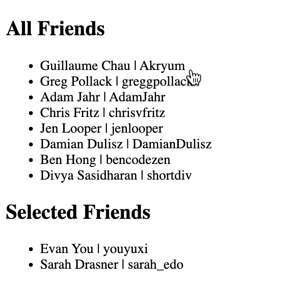

# Up & Running with VueJS Final Challenge

In this final challenge you are going to take what you have learned in this course and build a small application. In a previous lesson we built a friends application that looped over a list of friends using the `v-for` directive. We are going to do something similar here but add some functionality to it.

## Challenge Instructions

If you open up `start.html` you will see the following data defined.

```js
<script>
  new Vue({
    el: '#app',
    data() {
      return {
        friends: [
          {name: 'Evan You', username: 'youyuxi'},
          {name: 'Guillaume Chau', username: 'Akryum'},
          {name: 'Sarah Drasner', username: 'sarah_edo'},
          {name: 'Greg Pollack', username: 'greggpollack'},
          {name: 'Adam Jahr', username: 'AdamJahr'},
          {name: 'Chris Fritz', username: 'chrisvfritz'},
          {name: 'Jen Looper', username: 'jenlooper' },
          {name: 'Damian Dulisz', username: 'DamianDulisz' },
          {name: 'Ben Hong', username: 'bencodezen'},
          {name: 'Divya Sasidharan', username: 'shortdiv'}
        ],
        selectedFriends: []
      }
    }
  });
</script>
```

First take the friends array and use that to display all of the records in an unordered list `<ul>`. Please add the list of friends below the heading **All Friends**. Include both the friend name and username in the list item `<li>`.

```html
<div id="app">
  <h2>All Friends</h2>

  <h2>Selected Friends</h2>

</div>
```

Next display the data in the selected friends array below the heading **Selected Friends**. There are currently no friends in that array so let's make sure we only show that unordered list if the length of that array is greater than 0.

Now that you have both of your lists being display you can add some interactivity to the application. When a user clicks on a friend in the first list I want you to remove it from friends list and add it to the selected friends list.



HINT: You can add an event listener to the list item
